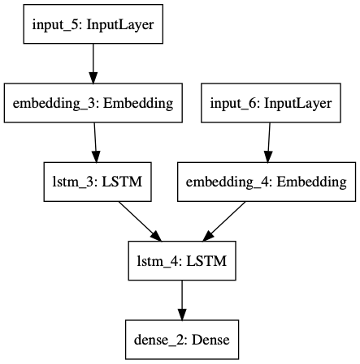

# NMT with Seq2Seq

英文基于词，中文基于字的中英文翻译seq2seq模型。

## Install

```
pandas
zhon
sklearn
pandas
```

## Usage

### 训练

```shell
python seq2seq_word_level_with_embedding
```



## 参考
- 数据生成器参考：[Word Level English to Marathi Neural Machine Translation using Encoder-Decoder Model](https://towardsdatascience.com/word-level-english-to-marathi-neural-machine-translation-using-seq2seq-encoder-decoder-lstm-model-1a913f2dc4a7)
- Embedding层的加入参考：[深度学习中Keras中的Embedding层的理解与使用](http://frankchen.xyz/2017/12/18/How-to-Use-Word-Embedding-Layers-for-Deep-Learning-with-Keras/)
- Keras官方Seq2Seq入门代码，代码基于char-level，博客最后有一个简单的word-based demo[A ten-minute introduction to sequence-to-sequence learning in Keras (word based参考)](https://blog.keras.io/a-ten-minute-introduction-to-sequence-to-sequence-learning-in-keras.html)
- [Keras关于LSTM的units参数，还是不理解?](https://www.zhihu.com/question/64470274)
- [基于keras的seq2seq中英文翻译实现](https://blog.csdn.net/PIPIXIU/article/details/81016974)
- [word2vec训练中文词向量](https://blog.csdn.net/lilong117194/article/details/82849054)
- 英文预训练词向量下载：[GloVe pre-training vector](https://nlp.stanford.edu/projects/glove/)
- 中文预训练词向量下载：[Chinese Word Vectors 中文词向量(使用字向量)](https://github.com/Embedding/Chinese-Word-Vectors)
- 训练翻译模型和训练词向量的数据集：[WMT 2020数据集](http://www.statmt.org/wmt20/translation-task.html)

## 其他参考

- [真正的完全图解Seq2Seq Attention模型](https://zhuanlan.zhihu.com/p/40920384)
- Tensorflow attention官方例子：[基于注意力的神经机器翻译](https://www.tensorflow.org/tutorials/text/nmt_with_attention)

## License

MIT © Richard McRichface